# Secure Asset Inventory Tool

[](https://opensource.org/licenses/MIT)
[](https://www.python.org/downloads/)

A professional desktop application for managing IT asset inventories with advanced features for tracking, reporting, and barcode generation.

## 📺 Demo Video

<!--YouTube placeholder - replace with your video link-->
[](https://www.youtube.com/watch?v=YOUR_VIDEO_ID)

*Click above to watch a full demonstration of the Secure Asset Inventory Tool*

---

## 📋 Table of Contents

- [Features](#-features)
- [Installation](#-installation)
- [Getting Started](#-getting-started)
- [User Guide](#-user-guide)
  - [Main Menu](#main-menu)
  - [Add New Assets](#add-new-assets)
  - [Browse Assets](#browse-assets)
  - [Search/Change Assets](#searchchange-assets)
  - [Reports and Analysis](#reports-and-analysis)
  - [Export Assets](#export-assets)
  - [Settings](#settings)
- [Configuration](#️-configuration)
- [Database](#️-database)
- [Template Files](#-template-files)
- [Troubleshooting](#-troubleshooting)
- [Contributing](#-contributing)
- [License](#-license)
- [Acknowledgments](#-acknowledgments)
- [Contact](#-contact)
- [Roadmap](#️-roadmap)
- [Version History](#-version-history)

---

## ✨ Features

### Core Functionality

- **SQLite Database Backend**: Fast, reliable, and portable asset database
- **Template-Driven Fields**: Customize asset fields via CSV templates
- **Advanced Search**: Multi-criteria search with AND/OR logic and saved searches
- **Bulk Operations**: Update multiple assets simultaneously with preset configurations
- **Export Capabilities**: Export to CSV/Excel with customizable templates for easy import into other systems
- **Barcode Generation**: Create Avery 5160-compatible barcode labels

### Reporting & Analysis

- **Visual Analytics**: Charts and graphs for asset distribution and trends
- **Audit Reports**: Identify assets not audited within specified timeframes
- **Label Generation Reports**: Track label requests by date
- **Duplicate Detection**: Find potential duplicate entries
- **Cubicle Analysis**: Analyze asset distribution by location
- **Hardware Maintenance Records (HMR)**: Track maintenance histories. **Coming Soon**
- **Destruction Certificates**: Generate asset disposal documentation. **Coming Soon**

### Advanced Features

- **Auto-Backup**: Automatic database backups
- **Error Handling**: Comprehensive error logging and recovery
- **Keyboard Shortcuts**: Efficient navigation with keyboard accelerators
- **Responsive UI**: Modern, professional interface with dark/light theme support
- **Multi-Window Support**: Work with multiple tools simultaneously

---

## 🚀 Installation

### Prerequisites

- Python 3.11 or higher
- Optimized for Windows 10/11
- ~100MB of free disk space

### Option 1: Download Pre-Built Executable (Windows Only - Easiest)

**No Python installation required!**

1. **Download the latest release:**

   - Visit the [Releases page](https://github.com/brettrbarker/SecureAssetInventoryTool/releases)
   - Download the latest `SecureAssetInventoryTool-vX.X.XXXXXX.exe` file

2. **Run the application:**

   - Double-click the downloaded `.exe` file
   - Windows may show a security warning (click "More info" → "Run anyway")
   - The application will create necessary directories and configuration files on first run

**Note:** Pre-built executables are created using the `build.ps1` script and include all dependencies.

### Option 2: Install from Source (All Platforms)

1. **Clone the repository:**

   ```bash
   git clone https://github.com/brettrbarker/SecureAssetInventoryTool.git
   cd SecureAssetInventoryTool
   ```

2. **Create a virtual environment (recommended):**

   ```bash
   python -m venv venv
   
   # On Windows:
   .\venv\Scripts\activate
   
   # On macOS/Linux:
   source venv/bin/activate
   ```

3. **Install dependencies:**

   ```bash
   pip install -r requirements.txt
   ```

4. **Run the application:**

   ```bash
   python main.py
   ```

### Option 3: Building Your Own Standalone Executable (Windows)

For Windows users who want to build from source, use the included PowerShell build script:

```powershell
.\build.ps1
```

This creates a standalone executable in the `releases/` directory that requires no Python installation.

---

## 🏁 Getting Started

### First Launch

1. **Launch the application** by running `python main.py` or executing the downloaded `.exe` file
2. The application will create default directories and configuration files
3. **Configure Settings** (Settings → Paths) to set:
   - Database location
   - Template file
   - Output directory

### Initial Setup

1. **Prepare Your Template**: 
   - Use the provided `assets/templates/default_template.csv` as a starting point
   - Customize column headers to match your organization's asset fields
   - Required fields should be prefixed with `*` (e.g., `*Asset Type`)

2. **Configure Field Categories** (Settings → Fields):
   - **Dropdown Fields**: Fields with predefined options
   - **Required Fields**: Mandatory fields for new assets
   - **Excluded Fields**: System-managed fields hidden from data entry
   - **Unique Fields**: Fields that must be unique per asset

3. **Import Existing Data** (optional):
   - Use Settings → Database Operations → Import from CSV

---

## 📖 User Guide

### Main Menu

The main menu provides access to all major functions:

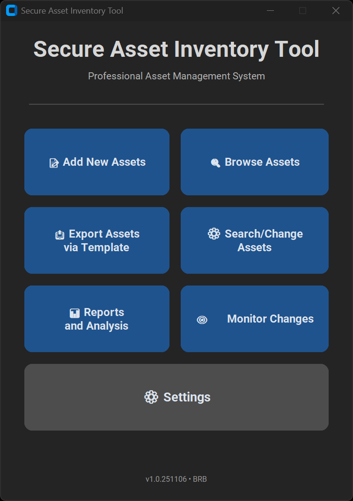

**Available Options:**

- **Add New Assets**: Create individual or multiple asset entries
- **Browse Assets**: Advanced search and asset management
- **Export Assets Via Template**: Export full database or recent added or changed assets using template structure
- **Search/Change Assets**: Make modifications to existing assets quickly. Save Presets for common changes or audit date updates
- **Reports and Analysis**: Generate various reports and analytics
- **Database Monitor**: View real-time database statistics and recent changes while you scan, add, or change assets
- **Settings**: Configure application preferences

### Add New Assets

**Purpose**: Add new assets to the inventory database

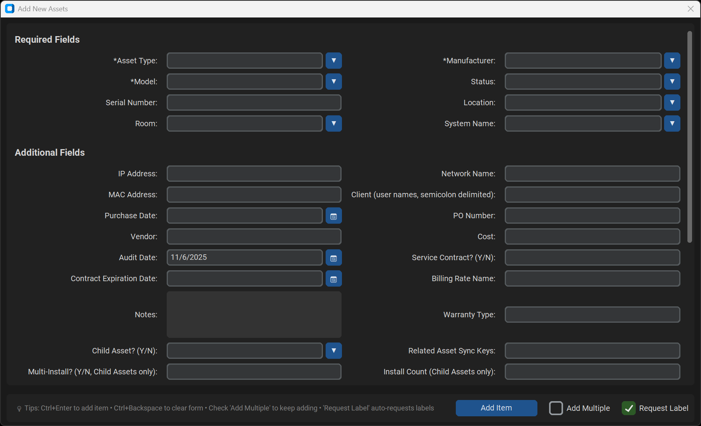

**How to Use:**

1. Click **"Add New Assets"** from the main menu
2. The form displays all fields from your template
   - **Required Fields** appear at the top (marked with `*`)
   - **Optional Fields** appear below
3. Fill in asset information:
   - **Dropdown Fields**: Type to search or select from existing values
   - **Date Fields**: Click calendar icon or type date in format `MM/DD/YYYY`
   - **Text Fields**: Enter information directly

**Features:**

- **Smart Dropdowns**: Type to filter existing values or add new entries
- **Auto-Date Fields**: Audit dates automatically populate with today's date
- **Add Multiple Mode**: 
  - Check the **"Add Multiple"** checkbox before submitting
  - After adding, unique fields clear while common fields remain
  - Useful for adding similar items (e.g., multiple computers of same model)

**Keyboard Shortcuts:**

- `Ctrl+Enter`: Submit form
- `Ctrl+Backspace`: Clear form

### Browse Assets

**Purpose**: Search, view, and manage existing assets

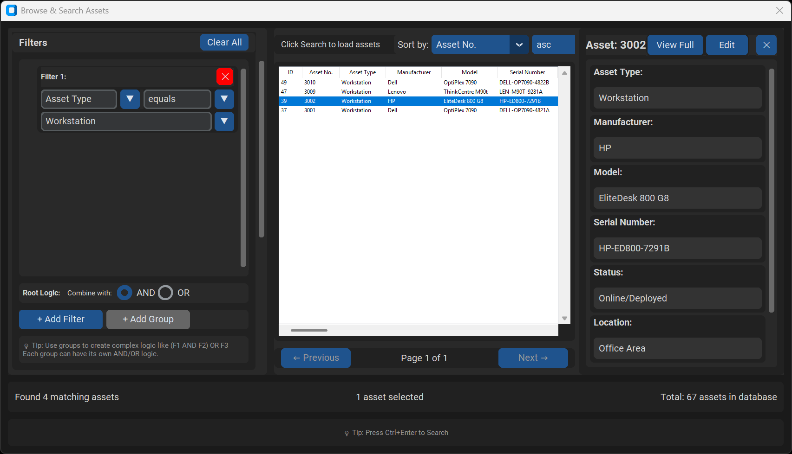

**How to Use:**

#### Basic Search

1. Click **"Browse/Search Assets"** from main menu
2. Click **"Search"** without any Filters to view all records (paginated)
3. Use table controls:
   - Click column headers to sort
   - Double-click row to view detailed asset information

#### Advanced Search

1. Click **"Add Filter"** to create search criteria
2. Configure each filter:
   - **Field**: Select which field to search
   - **Operator**: Choose comparison (contains, equals, starts with, etc.)
   - **Value**: Enter search term (dropdown fields show existing values)
3. Add multiple filters:
   - **AND Logic**: All conditions must match
   - **OR Logic**: Any condition matches
4. Click **"Search"** or press `Ctrl+Enter`

**Features:**

- **Saved Searches**: 
  - Click **"Save Current Search"** to name and save filter combinations
  - Select from saved searches list to quickly reload
  - Edit or delete saved searches as needed
- **Export Results**: Export filtered results to CSV/Excel
- **Pagination**: Configure items per page (50/100/200/500)

**Keyboard Shortcuts:**

- `Ctrl+F`: Focus on first filter
- `Ctrl+Enter`: Execute search
- `F5` or `Ctrl+R`: Refresh/reload data
- `Esc`: Clear all filters
- `Enter`: View asset details

### Search/Change Assets

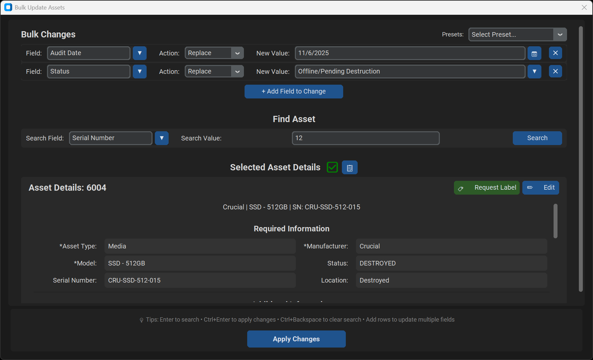

**Purpose**: Make modifications to existing assets quickly

**How to Use:**

1. Click **"Search/Change Assets"** from main menu
2. **Define Bulk Changes**:
   - Click **"Add Field to Change"** to add fields to update
   - Select field name and enter new value
   - Add multiple field changes as needed
3. **Find Target Assets**:
   - **Method 1**: Search by field (e.g., search by Serial Number)
     - Enter (or scan) search criteria and click **"Search"**
4. Review the asset that will be updated in the display area
5. Click **"Apply Changes"** to execute updates

**Features:**

- **Presets**: Save common bulk update configurations for quick reuse
- **Live Preview**: See current asset values before updating
- **Field Edit**: Click **"Edit Full Asset"** to open complete asset editor

**Common Use Cases:**

- Update location for multiple assets during office moves
- Change status for assets being decommissioned
- Update audit dates while completing physical inventory
- Assign assets to new departments or users

**Keyboard Shortcuts:**

- `Ctrl+Backspace`: Clear and focus search field
- `Enter`: Execute search
- `Ctrl+Enter`: Apply changes

### Reports and Analysis

**Purpose**: Generate comprehensive reports and visualizations

**Available Reports:**

#### 1. Overview Dashboard

- **Total asset count** and database statistics
- **Asset distribution charts** (by type, manufacturer, location, status)
- **Audit compliance metrics**
- **Recent activity summary**
- Click **"🔄 Refresh Dashboard"** to update data

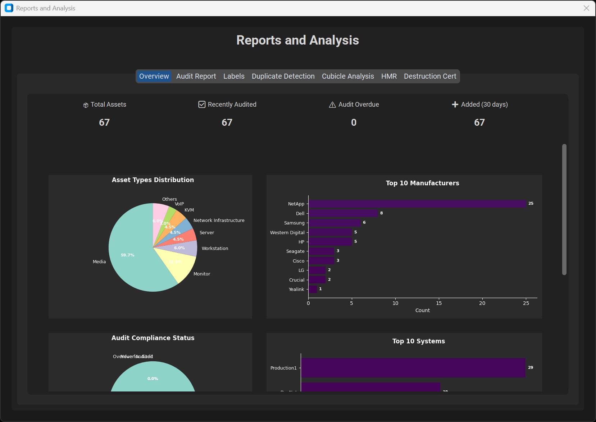

#### 2. Audit Report

- Find assets **not audited** within specified days
- Default: 365 days (customizable)
- Results show: Asset No., Type, Manufacturer, Model, Location, Last Audit Date
- **Export to Excel** for distribution to auditors
- **Double-click** any asset to view full details

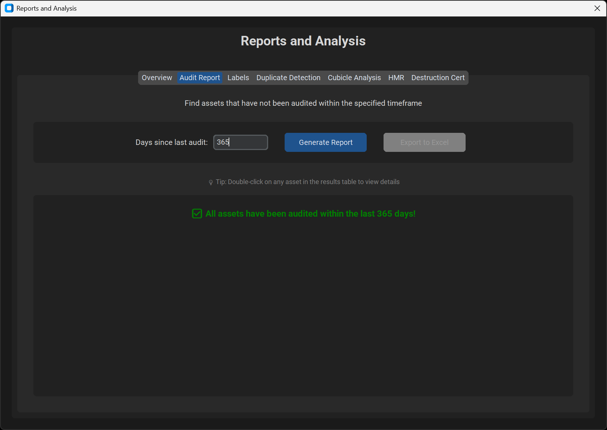

#### 3. Labels Report

- Find assets with **label requests** based on date criteria
- Filter by date range or specific dates
- Useful for batch label printing
- Export results or generate barcodes directly

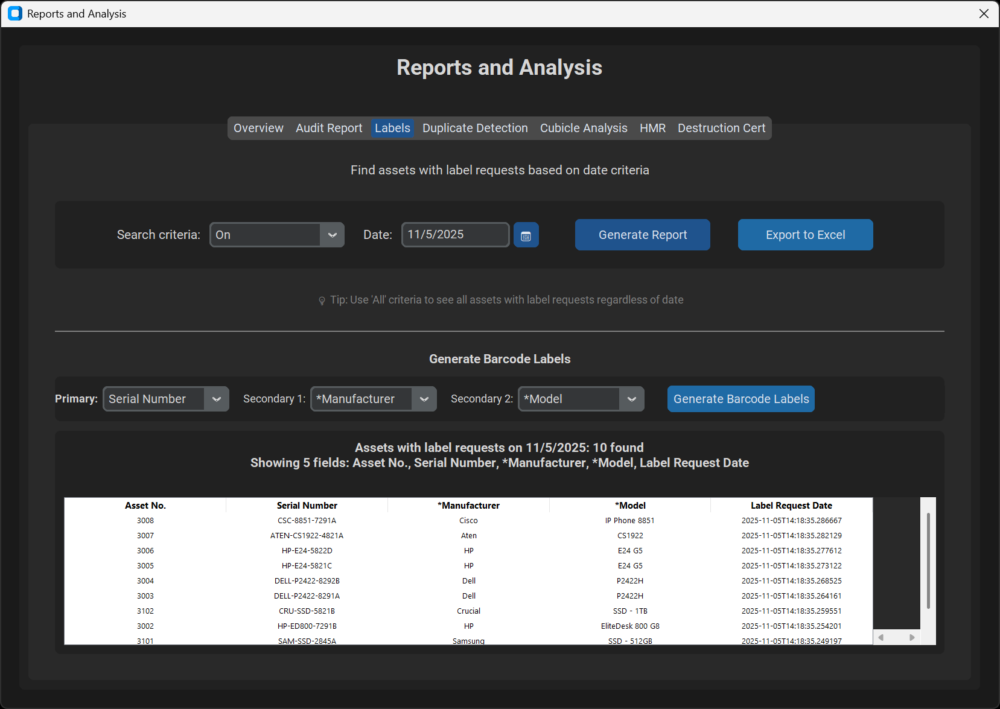

#### 4. Duplicate Detection

- Identify potential **duplicate entries**
- Search by: Serial Number, Asset Number, IP Address, MAC Address
- Review and merge/delete duplicates

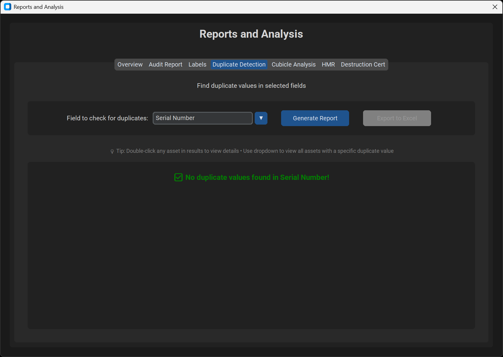

#### 5. Cubicle Analysis

- Analyze **asset distribution by location**
- View assets per cubicle/room
- Identify over/under-utilized spaces
- Find misplaced devices by searching for cubicles that don't match expected assets

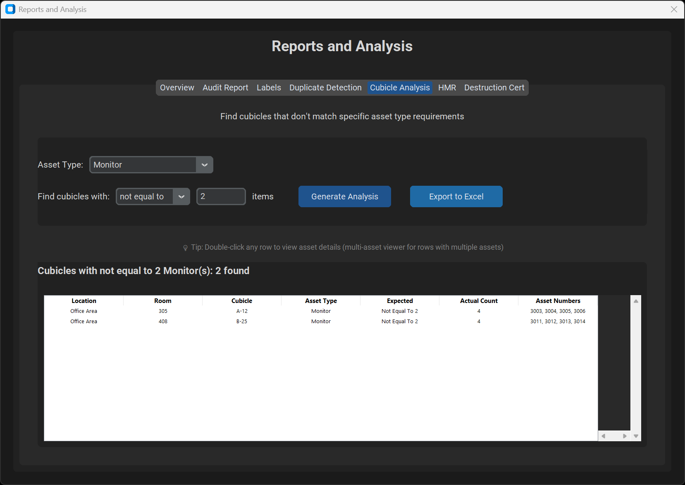

#### 6. Hardware Maintenance Records (HMR) 🚧 *Coming Soon*

- Generate asset hardware reports for facility entry/exit approval
- *Note: This feature is currently under development*

#### 7. Destruction Certificates 🚧 *Coming Soon*

- Generate **disposal documentation**
- Required for asset write-offs and disposal regulations
- Includes: Asset details, destruction date, authorization
- PDF export ready for signatures
- *Note: This feature is currently under development*

**Features:**

- **Interactive Charts**: Click elements to drill down
- **Date Range Filters**: Flexible date selection
- **Export Options**: Excel, CSV, PDF formats
- **Print Preview**: Review before printing
- **Scheduled Reports**: Save report configurations for recurring use

### Export Assets

**Purpose**: Export asset data to external formats


**Export Options:**

#### 1. Export Database via Template

- Exports **all active assets** using template column order
- Creates CSV file with full dataset
- Includes all fields from template
- Ready for backup or external analysis

#### 2. Export Search Results

- Export **filtered results** from Browse/Search window
- Only includes assets matching current search criteria
- Useful for targeted reports

**How to Use:**

1. Click **"Export Assets via Template"** or use Export button in other windows
2. Choose destination folder and filename
3. Select format (CSV or Excel)
4. Click **"Export"**
5. Confirmation message shows file location

**Features:**

- **Large Dataset Support**: Efficiently handles thousands of records
- **Template Consistency**: Exported data matches template structure
- **Data Integrity**: Maintains field types and formatting
- **Quick Backup**: One-click full database export

### Monitor Changes

**Purpose**: View real-time database statistics and recent changes while you scan, add, or change assets

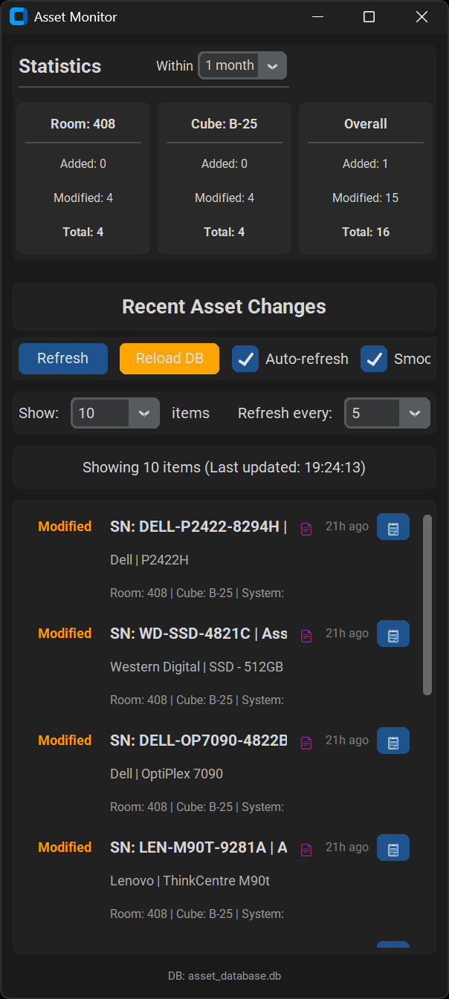

### Settings

**Purpose**: Configure application behavior and paths

**Settings Categories:**

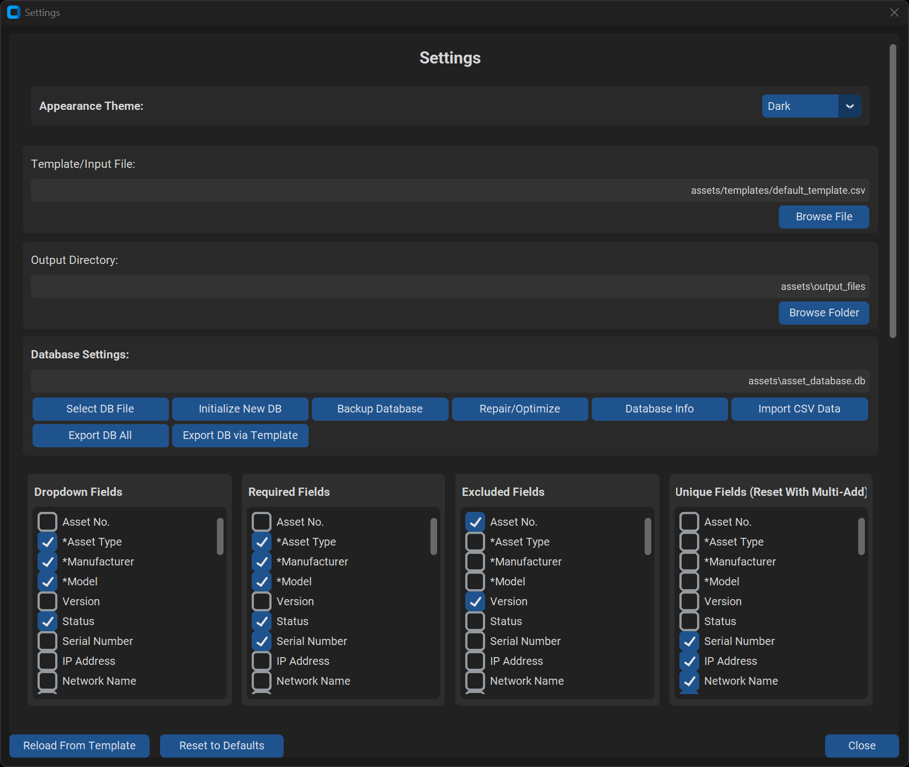

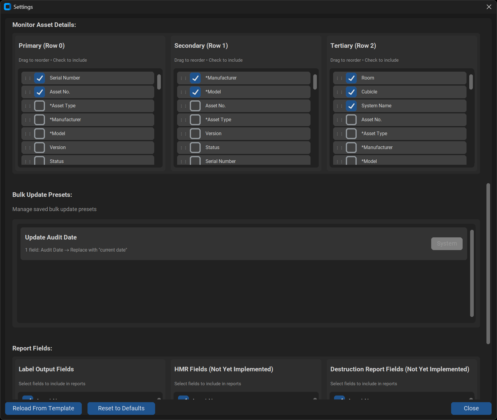

#### 1. Paths

Configure file locations:

- **Database Path**: SQLite database location
- **Template Path**: Default CSV template for asset fields
- **Output Directory**: Location for exporting files, reports, and labels

**Tips:**

- Use **relative paths** for portability (e.g., `./assets/database.db`)
- Use **absolute paths** for network locations
- Click **"Browse"** to select folders visually
- Click **"Open Folder"** to view directory contents

#### 2. Fields

Configure field behavior:

- **Dropdown Fields**: Add/remove fields that use dropdown selection
- **Required Fields**: Specify mandatory fields for new assets
- **Excluded Fields**: Hide system-managed fields from data entry
- **Unique Fields**: Fields that must be unique (cleared during bulk add)

#### 3. Appearance

- **Theme**: Switch between Light and Dark modes

#### 4. Database Operations

- **Repair/Optimize**: Run VACUUM and integrity check (combines optimization and validation)
- **Backup Database**: Create manual timestamped backup
- **View Statistics**: See table sizes and record counts
- **Import from CSV**: Bulk import assets from external file
- **Schema Migration**: Update database structure for new versions

**Note:** Automatic backups run on every startup, keeping the most recent 5 versions in `assets/auto_backups/`.

---

## ⚙️ Configuration

### Configuration File

Settings are stored in `assets/config.json`. While most configuration is done through the Settings menu, advanced users can edit directly:

```json
{
  "database_path": "assets/database.db",
  "default_template_path": "assets/templates/default_template.csv",
  "output_directory": "assets/output",
  "export_directory": "assets/exports",
  "labels_directory": "assets/labels",
  "theme": "dark",
  "dropdown_fields": [
    "System Name",
    "*Asset Type",
    "*Manufacturer",
    "*Model",
    "Status",
    "Location",
    "Room"
  ],
  "required_fields": [
    "System Name",
    "*Asset Type",
    "*Manufacturer",
    "*Model",
    "Status",
    "Location",
    "Serial Number"
  ],
  "excluded_fields": [
    "Asset No.",
    "Version",
    "Service Contract? (Y/N)",
    "Delete (Y/N)"
  ],
  "unique_fields": [
    "Serial Number",
    "IP Address",
    "MAC Address"
  ]
}
```

---

## 🗄️ Database

### Database Structure

The tool uses SQLite for reliable, portable data storage. Key characteristics:

- **Single File**: Entire database in one `.db` file
- **No Server Required**: Embedded database, no installation needed
- **ACID Compliant**: Guaranteed data consistency
- **Concurrent Access**: Multiple windows can access simultaneously
- **Compact**: Efficient storage with vacuum capability

### Table Schema

Tables are **dynamically created** based on your CSV template. Common fields include:

- `id`: Primary key (auto-increment)
- `asset_no`: Unique asset identifier
- `asset_type`: Category (computer, monitor, etc.)
- `manufacturer`: Equipment manufacturer
- `model`: Model number/name
- `serial_number`: Serial number
- `status`: Active, Retired, etc.
- `location`, `room`, `cubicle`: Physical location
- `created_date`, `modified_date`: Tracking metadata
- `created_by`, `modified_by`: User audit trail
- `is_deleted`: Soft delete flag

### Maintenance

Regular maintenance ensures optimal performance:

1. **Repair/Optimize** (Settings → Database Operations → Repair/Optimize)
   - Runs integrity check to detect database corruption
   - Executes VACUUM to reclaim unused space and defragment database
   - Displays current database size after optimization
   - Recommended: Run monthly or after bulk deletions

2. **Manual Backup** (Settings → Database Operations → Backup Database)
   - Creates timestamped backup copy of database
   - Useful before major changes or migrations
   - Backups stored in database directory

3. **Automatic Backups**
   - Runs automatically on application startup
   - Keeps rotating backups (most recent 5 versions)
   - Stored in `assets/auto_backups/` directory
   - Named sequentially: `database_autobackup_1.db` through `database_autobackup_5.db`
   - No configuration needed - always enabled

---

## 📄 Template Files

### Template Format

Templates are CSV files that define asset fields. The first row contains column headers:

```csv
Asset No.,*Asset Type,*Manufacturer,*Model,Serial Number,Status,Location,Room,IP Address,Notes
```

**Field Naming Conventions:**

- Prefix with `*` for **required fields** (e.g., `*Asset Type`)
- Use **clear, descriptive names** (e.g., "IP Address" not "IP")
- **Avoid special characters** except spaces, hyphens, and parentheses
- **Consistency matters**: "MAC Address" vs "Mac Address" are different fields

### Creating Custom Templates

1. Start with `assets/templates/default_template.csv`
2. Add/remove columns as needed for your organization
3. Mark required fields with `*` prefix
4. Save as new template
5. Configure in Settings → Paths → Template Path

### Template Best Practices

- **Keep field names under 30 characters**
- **Use consistent capitalization**
- **Group related fields** (e.g., all location fields together)
- **Version your templates** (e.g., `template_v2.csv`)

### Sample Templates

The tool includes sample templates:

- `default_template.csv`: General IT asset tracking
- `sample.csv`: Example with populated data for testing

---

## 🔧 Troubleshooting

### Common Issues

#### Application Won't Start
**Symptoms**: Python errors on launch, missing modules

**Solutions:**

1. Verify Python 3.11+ is installed: `python --version`
2. Reinstall dependencies: `pip install -r requirements.txt`
3. Check virtual environment is activated
4. Try rebuilding virtual environment: `.\rebuild_venv.ps1` (Windows)

#### Database Errors

**Symptoms**: "Database locked", "Corrupted database", slow performance

**Solutions:**

1. Close all application windows
2. Run Settings → Database Operations → Verify Integrity
3. If corrupted, manually restore from backup:
   - Close the application completely
   - Navigate to your backup directory (default: `assets/auto_backups/`)
   - Copy the most recent backup file (e.g., `database_backup_20251106_143052.db`)
   - Replace your current database file with the backup copy
   - Restart the application
   - *Note: Automatic restore feature is planned for a future release*
4. Check disk space (database needs 2x current size for vacuum)

#### Template Not Loading

**Symptoms**: "Template file not found", empty form fields

**Solutions:**

1. Verify template path in Settings → Paths → Template Path
2. Check template file exists and is readable
3. Ensure template has valid CSV format (open in Excel/text editor)
4. Check first row contains column headers
5. Verify no special characters or encoding issues

#### Export Failures

**Symptoms**: "Export failed", incomplete CSV files

**Solutions:**

1. Check export directory permissions (Settings → Paths)
2. Ensure sufficient disk space
3. Close Excel/other programs that may lock files
4. Try exporting to different location
5. Check for very long field values (>32,000 characters)

#### Barcode Generation Issues

**Symptoms**: Barcodes don't scan, misaligned labels

**Solutions:**

1. Verify using Avery 5160 label sheets
2. Check printer settings: "Actual Size", no scaling
3. Print test page to align printer
4. Ensure barcode values don't contain spaces or special characters
5. Use high-quality barcode scanner

### Getting Help

If issues persist:

1. Check the error log: `assets/logs/error.log`
2. Review performance metrics: Database Monitor window
3. Create GitHub issue with:
   - Error message
   - Steps to reproduce
   - Log file contents
   - Python version and OS

---

## 🤝 Contributing

Contributions are welcome! Please follow these guidelines:

### Development Setup

1. Fork the repository
2. Clone your fork: `git clone https://github.com/YOUR_USERNAME/SecureAssetInventoryTool.git`
3. Create a branch: `git checkout -b feature/your-feature-name`
4. Make changes and test thoroughly
5. Commit with clear messages: `git commit -m "Add feature: description"`
6. Push to your fork: `git push origin feature/your-feature-name`
7. Create Pull Request on GitHub

### Code Standards

- Follow PEP 8 style guide
- Add docstrings to all functions and classes
- Include type hints where appropriate
- Update README for user-facing changes
- Test on Windows, macOS, and Linux if possible

### Testing

Before submitting PR:

1. Test all CRUD operations (Create, Read, Update, Delete)
2. Verify backward compatibility with existing databases
3. Test with various template configurations
4. Check performance with large datasets (>1,000 records)
5. Ensure no errors in console/log files

---

## 📜 License

This project is licensed under the MIT License - see the [LICENSE](LICENSE) file for details.

```text
MIT License

Copyright (c) 2025 Brett Barker

Permission is hereby granted, free of charge, to any person obtaining a copy
of this software and associated documentation files (the "Software"), to deal
in the Software without restriction...
```

---

## 🙏 Acknowledgments

- **CustomTkinter** - Modern and customizable GUI framework
- **ReportLab** - PDF generation for barcode labels
- **Python Barcode** - Code128 barcode generation
- **Matplotlib & Seaborn** - Data visualization and charts
- **Pandas** - Data manipulation and analysis
- All contributors and users of this tool

---

## 📧 Contact

**Author**: Brett Barker  
**GitHub**: [@brettrbarker](https://github.com/brettrbarker)  
**Project Link**: [https://github.com/brettrbarker/SecureAssetInventoryTool](https://github.com/brettrbarker/SecureAssetInventoryTool)

---

## 🗺️ Roadmap

### Planned Features

- [ ] **Hardware Maintenance Records (HMR)** - Complete maintenance tracking system
- [ ] **Destruction Certificates** - Automated asset disposal documentation
- [ ] **Database Restore Function** - GUI-based backup restoration with version selection
- [ ] **Database Encryption** - Enhanced security with encrypted database storage

---

## 📊 Version History

### Version 1.0.251106 (Current)

- Initial public release
- Core asset management functionality
- Advanced search and reporting
- Barcode label generation
- Quick asset adding and auditing

---

**⭐ If you find this tool useful, please consider giving it a star on GitHub!**
